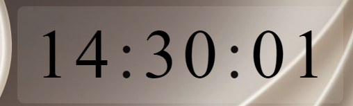

# Digital Clock / 桌面大时钟

A beautiful, customizable desktop clock built with **Electron**. Features smooth digit-scrolling animations, multi-timezone support, auto day/night color switching, and a fully customizable display.

## Features

- **Animated digit transitions** — vertical scroll effect with configurable speed
- **Fully customizable** — color, background (rgba), font, font size, window position
- **Date display** — with configurable position (above / below the time)
- **Multi-timezone support** — show up to 2 additional timezones inline
- **Auto black/white** — automatically switches text color based on day/night
- **Always on top / Desktop mode** — choose whether the clock stays above all windows
- **Mouse passthrough** — make the entire window click-through
- **System tray** — right-click for settings, left-click to toggle visibility
- **Bilingual** — Chinese (zh) and English (en) interface
- **Persistence** — all settings saved to `config.json` automatically

## Screenshots



## Quick Start

```bash
# Install dependencies
npm install

# Run
npm start

# Build portable executable
npm run dist
```

The built executable will be in `dist/` as a portable Windows app.

## Project Structure

```
├── main.js          # Electron main process (window, tray, IPC)
├── preload.js       # Context bridge (secure IPC exposure)
├── index.html       # Clock window
├── renderer.js      # Clock rendering, animation, real-time updates
├── styles.css       # Clock styles
├── settings.html    # Settings window
├── settings.js      # Settings logic
├── settings.css     # Settings styles
├── config.json      # User settings (auto-generated)
├── package.json     # Dependencies and build config
└── LICENSE          # MIT License
```

## Configuration

All settings are stored in `%APPDATA%/digital-clock/config.json` and can be
adjusted through the settings window (right-click tray icon → Settings).

Available settings: text color, background color (with alpha), font family,
font size, window position presets, show seconds, show date, date position,
timezone display, layer mode, auto-start, mouse passthrough, animation speed,
and language.

## Tech Stack

- **Electron** — cross-platform desktop framework
- **Vanilla JavaScript** — no frameworks, lightweight and fast
- **CSS Custom Properties** — dynamic animation duration via CSS variables
- **IPC** — main/renderer process communication via Electron IPC

## License

MIT © 2026 Yejack819
